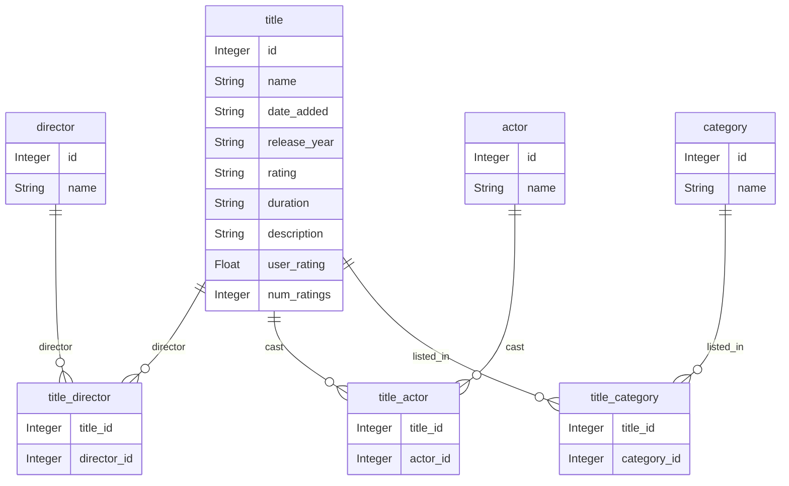

# Netflix titles

* Normalize the given dataset netflix_titles.csv

* Feed detail and catalog tables from `netflix_titles` table

* Build a RESTful API around the model, allowing result pagination and observing HATEOAS best practices.

    * `/api/title/{id}`
    * `/api/director/{id}`
    * `/api/actor/{id}`
    * `/api/category/{id}`

* Data validation
  * Catalog names are mandatory
  * Release year must be in range 1900-current year
  * User rating must be in 0-10 range
  * Number of reviews cannot be negative

* Implement endpoints to search by name, release year, description

* Implement endpoints to view titles by director, actor, category

* Provide a set of recommendations using the following endpoints

    * `/api/recommend/best?top=10`
    Best rated titles overall

    * `/api/recommend/category/{id}?top=10`
    Best rated titles by category

* Authentication
    * Unauthenticated reads
    * Writes and deletions require basic authentication
    * Assign users to different roles
    * Create and Update require the USER role
    * Deletions require the ADMIN role

* Build unit and integration tests for CRUD operations in all entities for all features.

* Non-functional requirements
    * Expose observability endpoints under `/manage`
        * Application health
            * Application up
            * Disk space
            * Database connection
        * Metrics
            * Keep track of number of requests
        * Endpoints
            * Show a list of all configured endpoints
